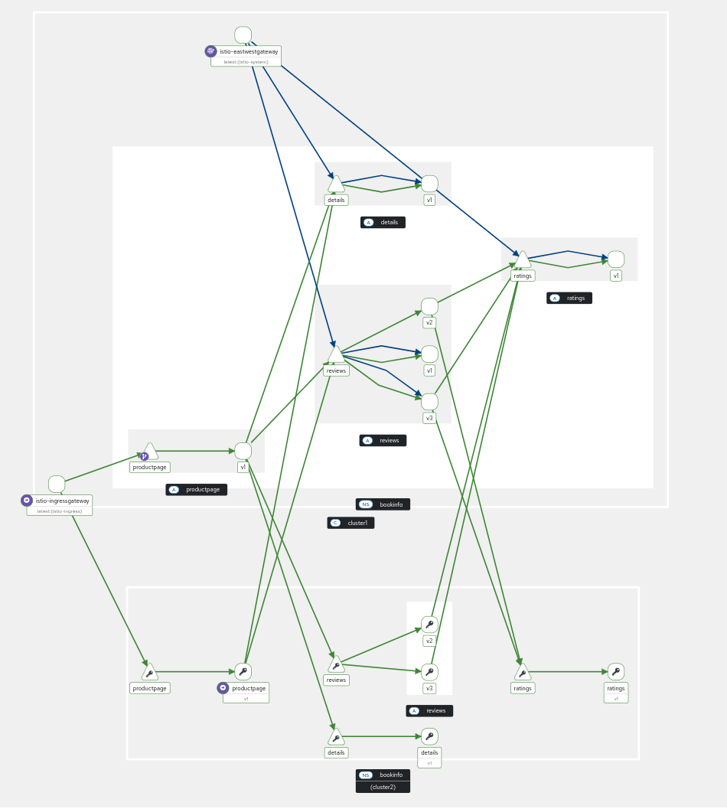

# multicluster configs east



# notes

in east we simulate an external issuer by create a root-ca and two intermediary CAs (east-ca, west-ca) 


```sh
rm -rf .certs
mkdir .certs
cd .certs
openssl genrsa -out root-key.pem 4096
cat >> root-ca.conf <<EOF
encrypt_key = no
prompt = no
utf8 = yes
default_md = sha256
default_bits = 4096
req_extensions = req_ext
x509_extensions = req_ext
distinguished_name = req_dn
[ req_ext ]
subjectKeyIdentifier = hash
basicConstraints = critical, CA:true
keyUsage = critical, digitalSignature, nonRepudiation, keyEncipherment, keyCertSign
[ req_dn ]
O = Istio
CN = Root CA
EOF
openssl req -sha256 -new -key root-key.pem \
  -config root-ca.conf \
  -out root-cert.csr
openssl x509 -req -sha256 -days 3650 \
  -signkey root-key.pem \
  -extensions req_ext -extfile root-ca.conf \
  -in root-cert.csr \
  -out root-cert.pem
mkdir east
openssl genrsa -out east/ca-key.pem 4096

cat >> east/intermediate.conf <<EOF
[ req ]
encrypt_key = no
prompt = no
utf8 = yes
default_md = sha256
default_bits = 4096
req_extensions = req_ext
x509_extensions = req_ext
distinguished_name = req_dn
[ req_ext ]
subjectKeyIdentifier = hash
basicConstraints = critical, CA:true, pathlen:0
keyUsage = critical, digitalSignature, nonRepudiation, keyEncipherment, keyCertSign
subjectAltName=@san
[ san ]
DNS.1 = istiod.istio-system.svc
[ req_dn ]
O = Istio
CN = Intermediate CA
L = east
EOF
openssl req -new -config east/intermediate.conf \
   -key east/ca-key.pem \
   -out east/cluster-ca.csr
openssl x509 -req -sha256 -days 3650 \
   -CA root-cert.pem \
   -CAkey root-key.pem -CAcreateserial \
   -extensions req_ext -extfile east/intermediate.conf \
   -in east/cluster-ca.csr \
   -out east/ca-cert.pem
cat east/ca-cert.pem root-cert.pem > east/cert-chain.pem && cp root-cert.pem east
mkdir west
openssl genrsa -out west/ca-key.pem 4096
cat >> west/intermediate.conf <<EOF
[ req ]
encrypt_key = no
prompt = no
utf8 = yes
default_md = sha256
default_bits = 4096
req_extensions = req_ext
x509_extensions = req_ext
distinguished_name = req_dn
[ req_ext ]
subjectKeyIdentifier = hash
basicConstraints = critical, CA:true, pathlen:0
keyUsage = critical, digitalSignature, nonRepudiation, keyEncipherment, keyCertSign
subjectAltName=@san
[ san ]
DNS.1 = istiod.istio-system.svc
[ req_dn ]
O = Istio
CN = Intermediate CA
L = west
EOF
openssl req -new -config west/intermediate.conf \
   -key west/ca-key.pem \
   -out west/cluster-ca.csr
openssl x509 -req -sha256 -days 3650 \
   -CA root-cert.pem \
   -CAkey root-key.pem -CAcreateserial \
   -extensions req_ext -extfile west/intermediate.conf \
   -in west/cluster-ca.csr \
   -out west/ca-cert.pem
cat west/ca-cert.pem root-cert.pem > west/cert-chain.pem && cp root-cert.pem west
```

```sh
oc create secret generic cacerts -n istio-system --context "${CTX_CLUSTER1}" \
  --from-file=east/ca-cert.pem \
  --from-file=east/ca-key.pem \
  --from-file=east/root-cert.pem \
  --from-file=east/cert-chain.pem
oc create secret generic cacerts -n istio-system --context "${CTX_CLUSTER2}" \
  --from-file=west/ca-cert.pem \
  --from-file=west/ca-key.pem \
  --from-file=west/root-cert.pem \
  --from-file=west/cert-chain.pem
```

## (test) istio-csr verify 

> works but not working for multicluster

We need to add the generic secret to cert-manager <https://docs.redhat.com/en/documentation/red_hat_openshift_service_mesh/3.0/html/installing/ossm-cert-manager>

```sh
oc get -n istio-system secret east-ca -o jsonpath='{.data.tls\.crt}' | base64 -d > ca.pem
oc create secret generic -n cert-manager istio-root-ca --from-file=ca.pem=ca.pem
```

```sh
# this will just show the certificate presented by the gateway (ok, dotn worry) 
istioctl proxy-config secret -n istio-ingress $(oc get pods -n istio-ingress -o jsonpath='{.items..metadata.name}' --selector app=istio-ingressgateway) -o json | jq -r '.dynamicActiveSecrets[0].secret.tlsCertificate.certificateChain.inlineBytes' | base64 --decode | openssl x509 -text -noout

# will show Issuer: O=cert-manager + O=cluster.local, CN=east-ca after restarting the pod (Issuer: O=cluster.local before if deployed previously before istio-csr)
istioctl proxy-config secret -n bookinfo $(oc get pods -n bookinfo -o jsonpath='{.items..metadata.name}' --selector app=productpage) -o json | jq -r '.dynamicActiveSecrets[0].secret.tlsCertificate.certificateChain.inlineBytes' | base64 --decode | openssl x509 -text -noout
```