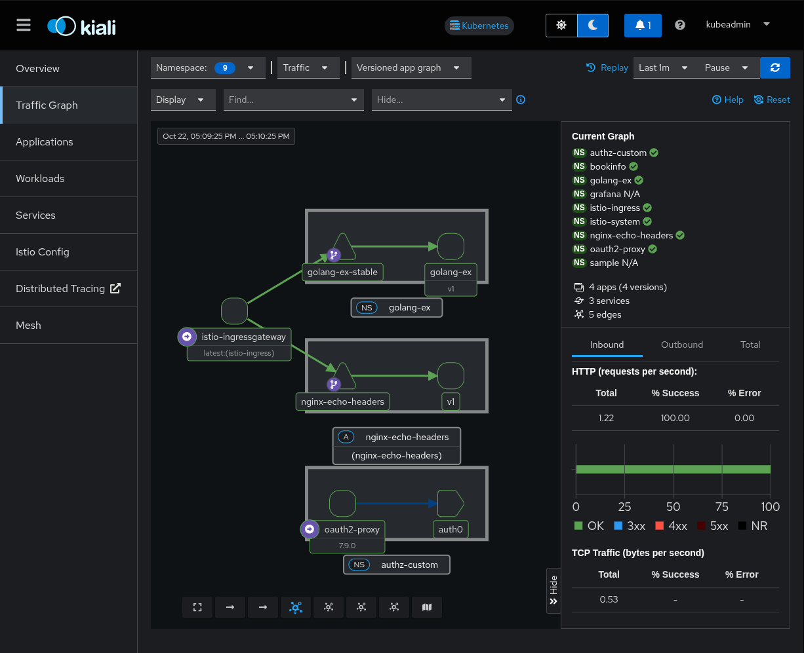
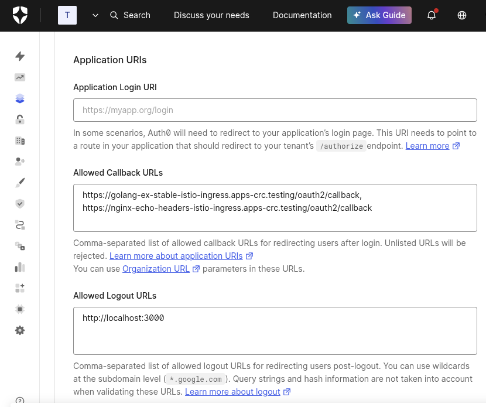

# oauth2-proxy for external authz Istio configruation

Demonstrates the golang-ex-stable and nginx-echo-headers using the same external authz (oauth2-proxy).

Docs:

* <https://istio.io/latest/docs/tasks/security/authorization/authz-custom/>

Notes:

* If you do not define redirect_urls in oauth2-proxy it will use the original host with /oauth2/callback as the path in the redirect request to the IDP.
* You can use `static://200` for the upstream to simply indicate authentication was successful and provide a static response code.

Kiali



Auth0 App



## configure auth0

Create an auth0 app and api programmatically.

```sh
auth0 login

#create the app
auth0 apps create --name authz-custom --description authz-custom --type regular \
  --callbacks https://nginx-echo-headers-istio-ingress.apps-crc.testing/oauth2/callback,https://golang-ex-stable-istio-ingress.apps-crc.testing/oauth2/callback

# get the client id from the list for myapp
auth0 apps list
export client_id=

#create the api
auth0 apis create --name myapi --identifier http://my-api

# authorize the app to the api
auth0 login --scopes create:client_grants
auth0 api post client-grants --data "{\"audience\":\"http://my-api\",\"client_id\":\"${client_id}\",\"scope\":[]}"

# get the client secret
auth0 apps show --reveal-secrets
```

* put the client id and secret in the [oauth2-proxy secret](REFERENCE-secret-oauth2-proxy.yaml).
* Note that audience must match the `identifier` (for example http://my-api) during authorize request. set this as parameter in oauth2-proxy [values.yaml](values.yaml), for example login_url = "https://dev-tqolyn342htgbviz.us.auth0.com/authorize?audience=http%3A%2F%2Fmy-api"
* requestauthentication-productpage.yaml audience must match the `identifier` as well

## notes

enable debugging in the productpage deployment spec.template.metadata.annotations

```yaml deployment
spec:
  template:
    metadata:
      annotations:
        sidecar.istio.io/inject: 'true'
        sidecar.istio.io/logLevel: 'rbac:debug,jwt:debug'  
```
