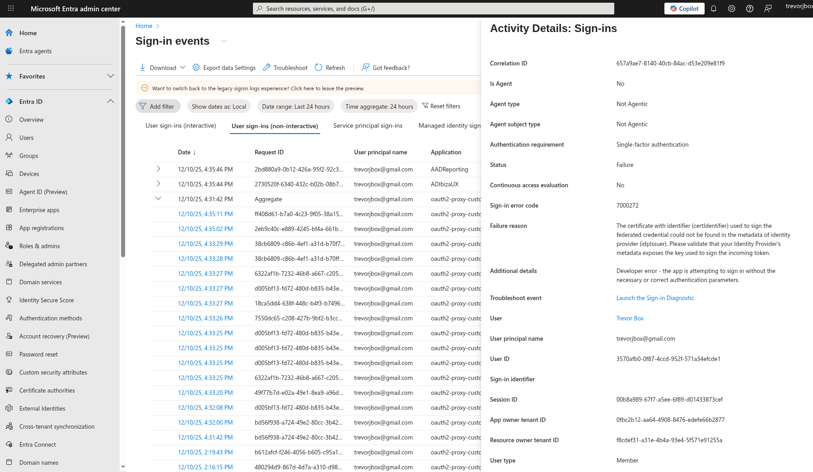

# oidc

<https://azure.github.io/azure-workload-identity/docs/installation/self-managed-clusters/oidc-issuer/discovery-document.html>

1. Create an Azure Blob storage account

```sh
export RESOURCE_GROUP="oidc-issuer"
export LOCATION="westus2"
az group create --name "${RESOURCE_GROUP}" --location "${LOCATION}"

export AZURE_STORAGE_ACCOUNT="oidcissuer$(openssl rand -hex 4)"
# This $web container is a special container that serves static web content without requiring public access enablement.
# See https://learn.microsoft.com/en-us/azure/storage/blobs/storage-blob-static-website
AZURE_STORAGE_CONTAINER="\$web"

az storage account create \
    --name "${AZURE_STORAGE_ACCOUNT}" \
    --resource-group "${RESOURCE_GROUP}" \
    --kind StorageV2 \
    --location "westus2" \
    --allow-blob-public-access true

az storage container create \
    --name "${AZURE_STORAGE_CONTAINER}" \
    --public-access blob

```

2. Generate the discovery document

```sh
cat <<EOF > openid-configuration.json
{
  "issuer": "https://${AZURE_STORAGE_ACCOUNT}.blob.core.windows.net/${AZURE_STORAGE_CONTAINER}/",
  "jwks_uri": "https://${AZURE_STORAGE_ACCOUNT}.blob.core.windows.net/${AZURE_STORAGE_CONTAINER}/openid/v1/jwks",
  "response_types_supported": [
    "id_token"
  ],
  "subject_types_supported": [
    "public"
  ],
  "id_token_signing_alg_values_supported": [
    "RS256"
  ]
}
EOF
```

3. Upload the discovery document

```sh
az storage blob upload \
  --container-name "${AZURE_STORAGE_CONTAINER}" \
  --file openid-configuration.json \
  --name .well-known/openid-configuration
```

4. Verify that the discovery document is publicly accessible

```sh
curl -s "https://${AZURE_STORAGE_ACCOUNT}.blob.core.windows.net/${AZURE_STORAGE_CONTAINER}/.well-known/openid-configuration"
```

0. allow anonymous access to JWKS

```sh
oc create -f clusterrolebinding-anonymous-issuer-discovery.yaml
```

2. Get the JWKS document from kube api

```sh
curl -k https://api.crc.testing:6443/openid/v1/jwks | jq -r > jwks.json
```

3. Upload the JWKS document

```sh
az storage blob upload \
  --container-name "${AZURE_STORAGE_CONTAINER}" \
  --file jwks.json \
  --name openid/v1/jwks
```

4. Verify that the JWKS document is publicly accessible

```sh
curl -s "https://${AZURE_STORAGE_ACCOUNT}.blob.core.windows.net/${AZURE_STORAGE_CONTAINER}/openid/v1/jwks"
```

## rotate kube-api signing key and update JWKS

<https://azure.github.io/azure-workload-identity/docs/topics/self-managed-clusters/service-account-key-rotation.html>

<https://docs.redhat.com/en/documentation/openshift_container_platform/4.20/html/postinstallation_configuration/changing-cloud-credentials-configuration#rotating-bound-service-keys_key-rotation-azure>

To cause the Kubernetes API server to create a new bound service account signing key, you delete the next bound service account signing key.

```sh
oc delete secrets/next-bound-service-account-signing-key \
  -n openshift-kube-apiserver-operator
```

To ensure that all pods on the cluster use the new key, you must restart them.

Important
This step maintains uptime for services that are configured for high availability across multiple nodes, but might cause downtime for any services that are not.

Restart all of the pods in the cluster by running the following command:

```sh
oc adm reboot-machine-config-pool mcp/master
```

Verify the new JWT

```sh
cat << EOF | oc apply -f -
apiVersion: v1
kind: ServiceAccount
metadata:
  annotations:
    azure.workload.identity/client-id: dummy
  name: workload-identity-sa
---
apiVersion: v1
kind: Pod
metadata:
  name: dummy-pod
  labels:
    azure.workload.identity/use: "true"
spec:
  serviceAccountName: workload-identity-sa
  containers:
    - name: busybox
      image: busybox
      command:
        - sleep
        - "3600"
EOF

oc exec dummy-pod -- cat /var/run/secrets/azure/tokens/azure-identity-token

```

> if you don't update the JWKS blob with the new key then you will get sign in errors



