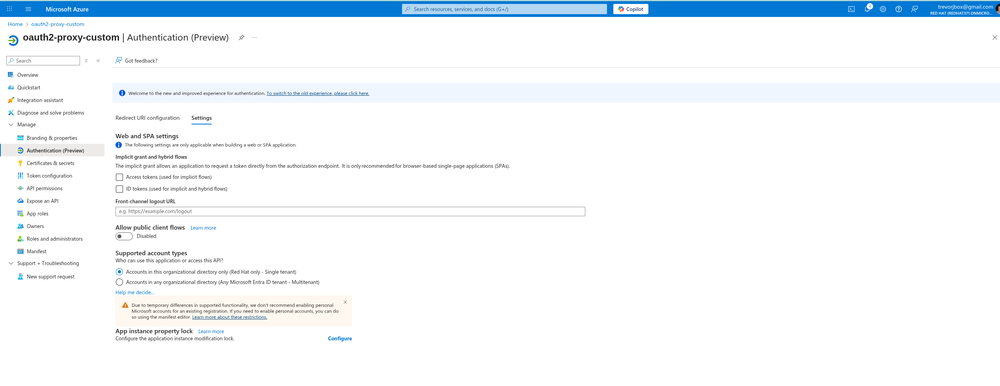
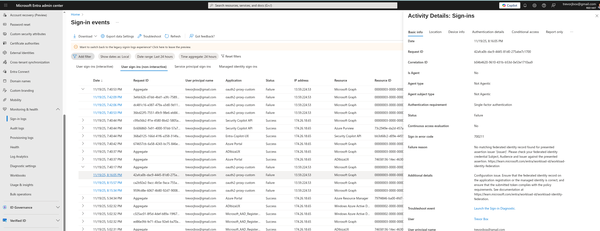

# oauth2-proxy Entra ID in front of UI

## configure Microsoft Entra ID

Create an Entra ID app registration.

Using terraform...

```sh
mkdir tf
cp main.tf tf/
cd tf
terraform init
terraform plan
terraform apply
```

Using UI...

Authentiction (preview) Redirect URI...


Authentiction (preview) settings...



Certificates and Secrets...


Federated Credential...

> note: using github to host the JWKS since it is publicly accessible


API permissions...


Token configuration (none)...


App Roles (none)...


Example App manifest...

```json
{
 "id": "a4cc0b1b-b33d-42c2-89b2-a65fd3a9b9ef",
 "acceptMappedClaims": null,
 "accessTokenAcceptedVersion": null,
 "addIns": [],
 "allowPublicClient": null,
 "appId": "81856e18-e059-49f0-b89b-6f156f44a72d",
 "appRoles": [],
 "oauth2AllowUrlPathMatching": false,
 "createdDateTime": "2025-11-19T20:30:40Z",
 "description": null,
 "certification": null,
 "disabledByMicrosoftStatus": null,
 "groupMembershipClaims": null,
 "identifierUris": [],
 "informationalUrls": {
  "termsOfService": null,
  "support": null,
  "privacy": null,
  "marketing": null
 },
 "keyCredentials": [],
 "knownClientApplications": [],
 "logoUrl": null,
 "logoutUrl": null,
 "name": "oauth2-proxy-custom",
 "notes": null,
 "oauth2AllowIdTokenImplicitFlow": false,
 "oauth2AllowImplicitFlow": false,
 "oauth2Permissions": [],
 "oauth2RequirePostResponse": false,
 "optionalClaims": null,
 "orgRestrictions": [],
 "parentalControlSettings": {
  "countriesBlockedForMinors": [],
  "legalAgeGroupRule": "Allow"
 },
 "passwordCredentials": [],
 "preAuthorizedApplications": [],
 "publisherDomain": "RedHat371.onmicrosoft.com",
 "replyUrlsWithType": [
  {
   "url": "https://test-test.apps.ambient.sandbox3242.opentlc.com/oauth2/callback",
   "type": "Web"
  }
 ],
 "requiredResourceAccess": [
  {
   "resourceAppId": "00000003-0000-0000-c000-000000000000",
   "resourceAccess": [
    {
     "id": "37f7f235-527c-4136-accd-4a02d197296e",
     "type": "Scope"
    }
   ]
  }
 ],
 "samlMetadataUrl": null,
 "signInUrl": null,
 "signInAudience": "AzureADMyOrg",
 "tags": [],
 "tokenEncryptionKeyId": null
}
```

## notes

Oauth2-proxy logs are not very descriptive when the external OIDC endpoint cannot be reached OR there is a mismatch with the issuer, namespace, or service account name of the service account JWT. The log below will be shown in either scenarios...

```sh
[2025/11/20 02:42:14] [oauthproxy.go:898] Error redeeming code during OAuth2 callback: token response did not contain an id_token
```

So you need to consult the sign-in logs in the [Entra Admin center](https://entra.microsoft.com/#view/Microsoft_AAD_IAM/SignInLogsList.ReactView/timeRangeType/last24hours/showApplicationSignIns~/true) to verify what the problem may be.

OIDC Failed...


Issuer mismatch...



Enable debugging in the productpage deployment spec.template.metadata.annotations

```yaml deployment
spec:
  template:
    metadata:
      annotations:
        sidecar.istio.io/inject: 'true'
        sidecar.istio.io/logLevel: 'rbac:debug,jwt:debug'  
```
